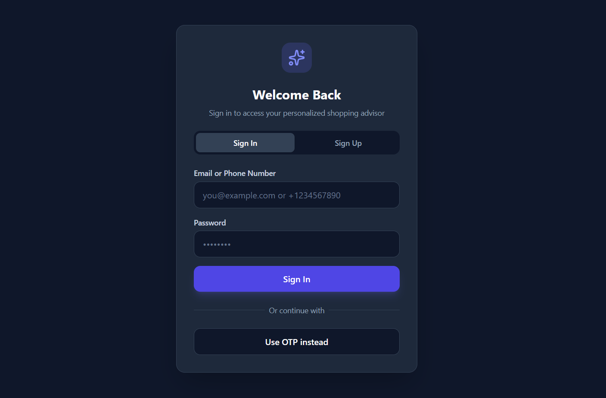
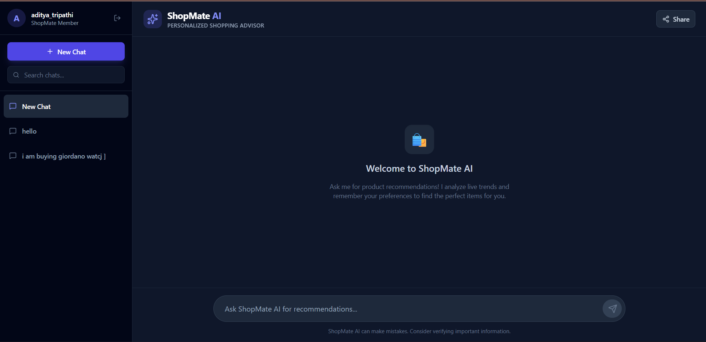
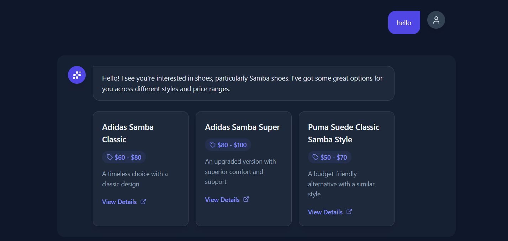

# 🛍️ ShopMate AI

> A Generative AI-powered shopping assistant that delivers personalized product recommendations using RAG, real-time data, and LLM intelligence.

---

## 🚀 Overview
**ShopMate AI** is an intelligent shopping assistant that understands user preferences, remembers past interactions, and fetches real-time product insights to recommend the best options.

It combines:
- 🧠 **Memory (FAISS)** – Stores and retrieves past user context  
- 🌐 **Live Data (Firecrawl)** – Fetches real-time product trends  
- 🤖 **LLM (Llama 3.3 via Groq)** – Generates smart recommendations  

---

## 🖼️ Application Preview

### 🔐 Authentication (Login / Signup)


---

### 💬 Chat Interface (Sidebar + AI Assistant)


---

### 🛍️ AI Product Recommendations


---

## 🎯 Key Features

### 🧩 RAG-Based Memory System
- FAISS vector database for storing chat history  
- Context-aware multi-turn conversations  
- Embeddings using HuggingFace (`all-MiniLM-L6-v2`)  

---

### 🌍 Real-Time Product Intelligence
- Firecrawl integration for live data  
- Dynamic and up-to-date recommendations  
- Avoids static or outdated responses  

---

### 🤖 LLM Orchestration
- Powered by **Groq (Llama 3.3 – 70B)**  
- Structured JSON responses  
- Enables reliable frontend rendering  

---

### 🎨 Modern UI/UX
- Built with **React (Vite) + Tailwind CSS**  
- Dark theme interface  
- Sidebar with chat history  
- Dynamic product recommendation cards  

---

## 🏗️ System Architecture

```
User → React Frontend → FastAPI Backend → LLM + FAISS + Firecrawl
                                      ↓
                              Structured JSON
                                      ↓
                             Dynamic UI Rendering
```

---

## ⚙️ Tech Stack

### Frontend
- React (Vite)  
- Tailwind CSS  

### Backend
- FastAPI  
- FAISS (Vector Database)  
- HuggingFace Transformers  

### AI & APIs
- Groq (Llama 3.3)  
- Firecrawl  

---

## 🔄 Workflow

1. User enters a query  
2. Backend retrieves past context (FAISS)  
3. Fetches real-time data (Firecrawl)  
4. LLM processes query + memory + live data  
5. Returns structured JSON  
6. Frontend renders product recommendations  

---

## 🧪 How to Run

### 1️⃣ Clone the Repository
```bash
git clone https://github.com/your-username/shopmate-ai.git
cd shopmate-ai
```

### 2️⃣ Setup Backend
```bash
cd backend
pip install -r requirements.txt
uvicorn main:app --reload
```

### 3️⃣ Setup Frontend
```bash
cd frontend
npm install
npm run dev
```

### ✅ Access the App
- Frontend: http://localhost:5173  
- Backend: http://127.0.0.1:8000  

### ⚠️ Environment Variables

Create a `.env` file inside the backend folder:

```env
GROQ_API_KEY=your_groq_api_key
FIRECRAWL_API_KEY=your_firecrawl_api_key
```

---

## 📁 Project Structure

```
shopmate-ai/
│── backend/
│── frontend/
│── assets/
│   ├── login.png
│   ├── chat-dashboard.png
│   ├── product-recommendations.png
│── README.md
```

---

## 🧠 Challenges Solved
- Maintaining conversational memory  
- Combining real-time + historical context  
- Enforcing structured LLM outputs  
- Building a smooth AI-driven UI  

---

## 🔮 Future Improvements
- User authentication (JWT / OAuth)  
- Chat deletion & history sync  
- Voice-based assistant  
- Product comparison system  

---

## 📌 Conclusion
ShopMate AI demonstrates how **RAG + Real-Time Data + LLMs** can be combined to build a **production-ready intelligent shopping assistant** with a modern UI and scalable backend.

---


## 👨‍💻 Author
**Aditya Tripathi**
